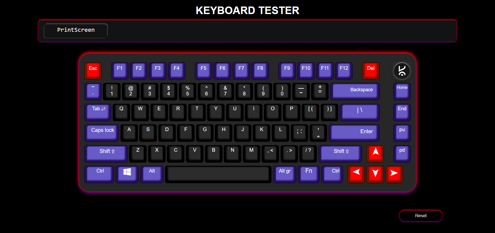

# Keyboard Tester 🎹

A simple and interactive **Keyboard Tester** built using **HTML**, **CSS**, and **JavaScript**. This tool helps users check if their keyboard keys are working correctly by visualizing key presses in real time.

## 🔍 Features

- ✅ Real-time key press detection
- 🎨 Interactive UI with highlighted key feedback
- 📱 Fully responsive design
- 🧠 Built with vanilla JavaScript (no external libraries)




## 🛠️ How to Use

1. Clone the repository:

   ```bash
   git clone https://github.com/Sakshamvijay-078/keyboard-mouse-tester-webApp-main.git


## 🧑‍💻 Technologies Used
  - HTML5
  - CSS3
  - Javascript

## 🤝 Contributing
Pull requests are welcome! For major changes, please open an issue first to discuss what you would like to change.
